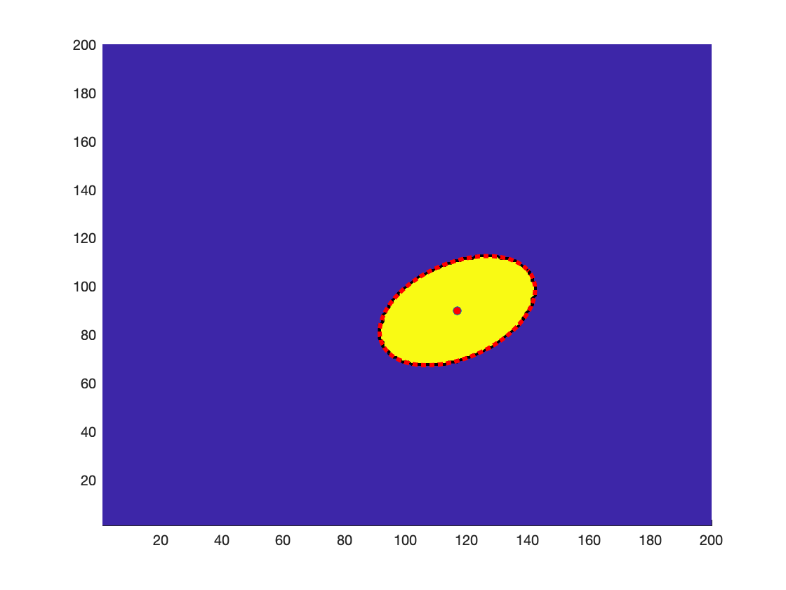

## ellipsoidMoments

In MatLAB, first create a test image, which is a random ellipsoid in a binary 200 x 200 matrix.  The ellipsoid will have random position, angle, size, and eccentricity

> binaryImage = testDroplet(1);

Next use the image moments method to determine the centroid (x0,y0), the rotation angle in radians (theta), and the semimajor axes (a,b):

> [x0 y0 theta a b] = dropletMoments(binaryImage);

This will also produce a figure where the original binary image is shown as yellow on a blue background, with the calculated centroid and ellipse outline shown in red.

# Sample output

> [x0 y0 theta a b]' =

>  116.9409   89.8130    0.6382   28.4511   18.5487

